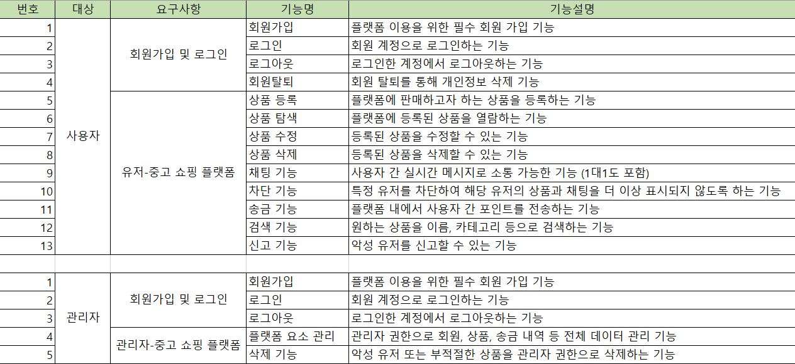
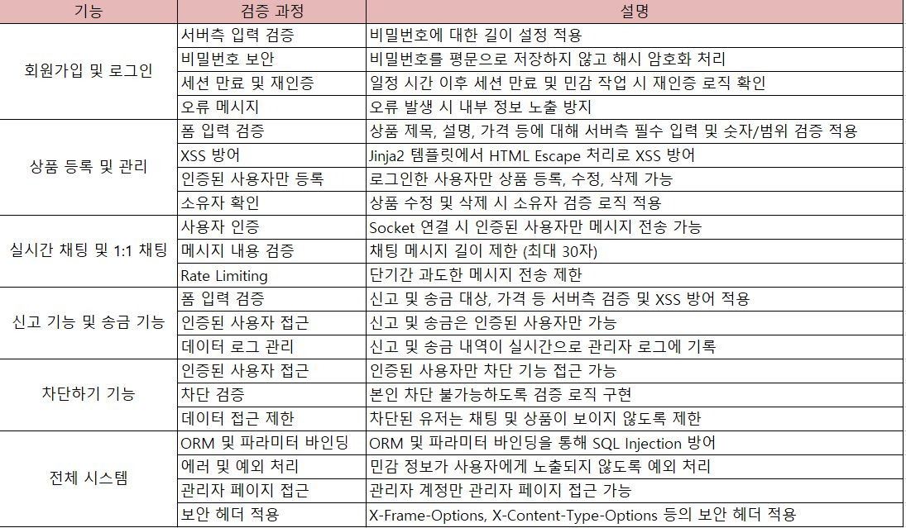

# Tiny-Second-hand-Shopping-Platform  
**[WHS 3기] 24반 김형석-시큐어 코딩 과제**

## 기능 설계


## 보안 검증 체크리스트


---

## 실행 방법

만약 Miniconda(또는 Anaconda)가 없다면, 아래 링크에서 설치할 수 있습니다.  
[Miniconda 설치 가이드](https://docs.anaconda.com/free/miniconda/index.html)

설치 후 아래 명령어를 실행하여 프로젝트 환경을 설정합니다.

```bash
git clone https://github.com/hyeongseok88/Tiny-Second-hand-Shopping-Platform.git
conda env create -f enviroments.yaml
```


서버 프로세스를 실행하려면 아래 명령어를 입력하세요.

```bash
python app.py
```
관리자 페이지에 접근하려면 아래 계정으로 로그인하세요.

```
id: admin
pw: 1234
```
